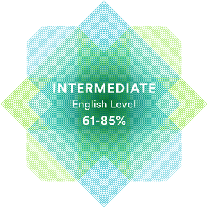

### Hey everyone! :wave: 
### My Name is Artyom Aleksikov.
##### Junior Frontend Developer.

---

#### Contact me:
- phone 89197991561
- e-mail fizrukaleksikov@gmail.com
- discord rtinit#7770

---

#### About me:
I'm an entury-level specialist and I don't have work experience, but my goal is to become the best in this direction. I'm constantly in search of new opportunities for self-study. I'm purposeful, fast-learning, stress-resistant, responsible, honest and open.

---

#### Skills:
- HTML;
- CSS;
- Java Script;
- Git / GitHub;
- Markdown;
- Figma;

---

#### Code Example:
Kata from www.codewars.com "Highest and Lowest"

``` java script
let str = "1 9 3 4 -5"
function highAndLow(str) {
    let numArr = str.split(' ');
    numArr = numArr.map(elem => elem = Number.parseInt(elem));
    numArr.sort((a, b) => a - b);
    
    return `${numArr[numArr.length - 1]} ${numArr[0]}`;
}

highAndLow(str)  // 9 -5
```

---

#### Projects:
- [Movie App](https://rtinit.github.io/movie-app/)
- [Audio player](https://rtinit.github.io/audio-player/)
- [Memory Game](https://rtinit.github.io/memory-game/)

---

#### Education:
- [Stage#0. Знакомство с профессией "JS/Front-end разработчик"](https://github.com/rolling-scopes-school/tasks/tree/master/stage0);
- [Stage#1."JS/Front-end разработчик"](https://github.com/rolling-scopes-school/tasks/tree/master/stage1);

---

#### Languages:
- Russian native;
- English A2-B1 www.efset.org


